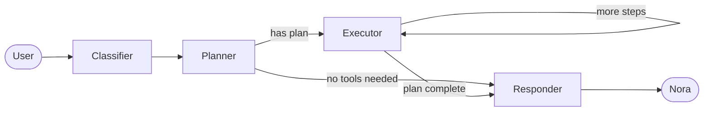

# Nora

**An open-source, capability-driven personal AI platform. Build your own Friday.**

Nora is not a chatbot. Not a workflow tool. A persistent, capable, evolving personal AI — designed to feel like Friday from Iron Man. She plans, executes, remembers, and gets smarter over time.

---

## How it works

Every request flows through a four-node graph:



- **Classifier** — reads the request, assigns model tiers (fast vs smart) based on complexity
- **Planner** — generates a structured execution plan using available capabilities
- **Executor** — runs the tools, loops until the plan is complete
- **Responder** — synthesizes results and replies as Nora

The graph is built on [LangGraph](https://github.com/langchain-ai/langgraph). State flows through every node — no hidden side effects.

---

## Architecture

```
nora/
├── agent/
│   ├── state.py              # AgentState — the heart of the system
│   ├── graph.py              # LangGraph graph assembly
│   ├── router.py             # Edge routing logic
│   ├── nodes/
│   │   ├── classifier.py     # Complexity + model tier assignment
│   │   ├── planner.py        # Dynamic plan generation
│   │   ├── executor.py       # Tool execution loop
│   │   └── responder.py      # Nora's voice
│   └── capabilities/
│       └── web_search/       # Search the web
│
├── projects/                 # Per-project config (YAML only, no code)
├── config/
│   └── settings.py           # Model map
└── main.py                   # CLI entrypoint
```

### Core principles

- **State is primary** — the graph is not the product, the state is
- **Capabilities, not features** — every tool cluster is general and reusable
- **Planner, not router** — Nora generates dynamic plans, not switch statements
- **Projects as config** — YAML profiles, zero code changes per project

---

## Getting started

**Requirements:** Python 3.13+, [uv](https://github.com/astral-sh/uv)

```bash
git clone https://github.com/yourusername/nora.git
cd nora
uv sync
```

Create a `.env` file:

```env
OPENAI_API_KEY=your_key_here
TAVILY_API_KEY=your_key_here
```

Run Nora:

```bash
uv run python main.py
```

---

## Capabilities

| Capability | What it does |
|---|---|
| `web_search` | Search the internet for up-to-date information |

More capabilities coming. Contributions welcome.

---

## Roadmap

- [x] Classifier → Planner → Executor → Responder graph
- [x] Web search capability
- [x] Dynamic model tier selection
- [ ] Long-term memory (Supabase + pgvector)
- [ ] FastAPI layer
- [ ] Multi-project profile support
- [ ] Self-improvement — Nora identifies and flags capability gaps

---

## Adding a capability

1. Create `agent/capabilities/your_capability/tools.py` — define your tools
2. Create `agent/capabilities/your_capability/capability.py` — export a `CAPABILITY` dict
3. Register it in `agent/capabilities/registry.py`

That's it. The planner picks it up automatically.

---

## Stack

- Python 3.13
- [LangGraph](https://github.com/langchain-ai/langgraph)
- [LangChain](https://github.com/langchain-ai/langchain)
- OpenAI API (GPT-4o / GPT-4o-mini)
- Tavily (web search)

---

## License

MIT
