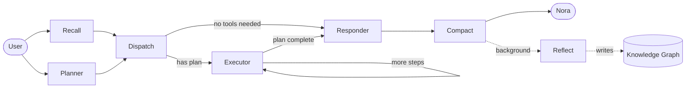

# Nora

**An open-source, capability-driven personal AI platform. Build your own Friday.**

Nora is not a chatbot. Not a workflow tool. A persistent, capable, evolving personal AI — designed to feel like Friday from Iron Man. She plans, executes, remembers across sessions, and gets smarter over time.

---

## How it works

Every request flows through a graph. `recall` and `planner` run **in parallel** from the start, join at a barrier, then route to the executor loop or straight to the responder. After Nora replies, `compact` trims the conversation window, then `reflect` distills the turn into long-term memory — off the critical path, so it never slows the response.



- **Recall** — searches long-term memory and loads relevant context into state before Nora responds (runs in parallel with the planner)
- **Planner** — classifies the request first: assigns a model tier (fast / smart / reasoning / vision) and decides whether any capability is needed, and which one(s). Only when a capability is needed does a second call bind just those capabilities' tools via native tool-calling to build the plan — simple requests cost one lightweight call and skip the executor entirely
- **Dispatch** — a sync barrier that joins the parallel `recall` + `planner` branches before routing
- **Executor** — runs each planned tool call directly via native tool-calling (`bind_tools`, no hand-parsed JSON), looping until the plan is complete
- **Responder** — synthesizes results and replies as Nora, streaming token-by-token. Uses recalled `memory_context` to personalise the response, and injects the current time plus the gap since the user was last active — so Nora is always temporally aware
- **Compact** — after the reply, counts tokens in the conversation window using `tiktoken` and drops the oldest messages when the thread exceeds the threshold (16K tokens by default). Keeps costs flat and prevents context overflow as the thread grows
- **Reflect** — distills the turn (intent, outcome, capability gaps) into the knowledge graph. Fired by the main loop as `asyncio.create_task` after the event stream ends — never blocks the response

The graph is built on [LangGraph](https://github.com/langchain-ai/langgraph). State flows through every node — no hidden side effects.

---

## Memory

Nora has two complementary memory layers:

| Layer | Technology | What it stores |
|---|---|---|
| Conversation checkpointing | SQLite + LangGraph `AsyncSqliteSaver` | Full message history for the current thread |
| Long-term semantic memory | [Graphiti](https://github.com/getzep/graphiti) + embedded FalkorDB | Distilled knowledge — entities, relationships, capability gaps |

**One eternal thread.** Nora is always-on. A single constant `thread_id` — no session boundaries, no reset between conversations.

The knowledge graph tracks seven entity types (`memory/schema.py`): `Person`, `Goal`, `Project`, `Preference`, `CapabilityGap`, `CapabilityInsight`, `RunOutcome`. `CapabilityGap` and `CapabilityInsight` are the foundation of the self-improvement loop — Nora records what she couldn't do so she can learn what to build next.

---

## Architecture

```
nora/
├── agent/
│   ├── state.py              # AgentState — the heart of the system
│   ├── graph.py              # LangGraph graph assembly (parallel fan-out + barrier)
│   ├── router.py             # Edge routing logic
│   ├── nodes/
│   │   ├── recall.py         # Pulls long-term memory before responding
│   │   ├── planner.py        # Model tier + dynamic plan (one LLM call)
│   │   ├── dispatch.py       # Sync barrier joining the parallel branches
│   │   ├── executor.py       # Tool execution loop
│   │   ├── responder.py      # Nora's voice
│   │   ├── compact.py        # Token-based context window trimming (post-response)
│   │   └── reflect.py        # Distills each turn into the knowledge graph (background)
│   └── capabilities/
│       ├── registry.py       # Composes native + MCP-bridged capabilities into one list
│       ├── types.py          # Capability type definition
│       ├── mcp_bridge.py     # Loads MCP servers from config/mcps.yaml — zero code per integration
│       ├── web_search/       # Search the web
│       └── introspect/       # Nora inspects her own capabilities (native + MCP-bridged)
│
├── memory/
│   ├── schema.py             # Graphiti entity types
│   └── store.py              # MemoryStore — write_episode, search, close
│
├── config/
│   ├── settings.py           # Model map + DB paths + thread config
│   ├── mcps.yaml             # MCP server registry — add integrations here, not in code
│   └── logging.py            # Logging setup
│
├── projects/                 # Per-project config (YAML only, no code)
├── data/                     # Runtime data (gitignored) — SQLite + FalkorDB
└── main.py                   # CLI entrypoint
```

### Core principles

- **State is primary** — the graph is not the product, the state is
- **Capabilities, not features** — every tool cluster is general and reusable
- **Planner, not router** — Nora generates dynamic plans, not switch statements
- **Memory from day one** — recall before, reflect after, on every turn
- **Projects as config** — YAML profiles, zero code changes per project

---

## Getting started

**Requirements:** Python 3.13+, [uv](https://github.com/astral-sh/uv)

```bash
git clone https://github.com/yourusername/nora.git
cd nora
uv sync
```

Create a `.env` file:

```env
OPENAI_API_KEY=your_key_here
TAVILY_API_KEY=your_key_here
```

Optional overrides (sensible defaults are used if unset):

```env
CONVERSATIONS_DB_PATH=data/nora_conversations.db
FALKORDB_DB_PATH=data/graph/nora_knowledge.db
THREAD_ID=thread-1

# LangSmith — enables tracing for memory reads/writes (optional)
LANGCHAIN_TRACING_V2=true
LANGCHAIN_API_KEY=your_langsmith_key_here

# Only needed for MCP servers that require credentials (e.g. the github entry in config/mcps.yaml)
GITHUB_TOKEN=your_github_token_here
```

MCP servers are registered in `config/mcps.yaml` — see the file for the schema. It's environment-specific (local paths, credentials via env vars), so review it before adding your own entries.

Logs are written to `data/nora.log` on every run (always-on, no env var needed).

Run Nora:

```bash
uv run main.py
```

FalkorDB runs **embedded** (via `redislite`) — no separate database server to start. The knowledge graph and conversation history are persisted under `data/`.

---

## Capabilities

| Capability | What it does |
|---|---|
| `web_search` | Search the internet for up-to-date information |
| `introspect` | Inspect Nora's own capabilities, execution context, and known project profiles |

Beyond the native ones above, Nora auto-registers any MCP server listed in `config/mcps.yaml` — zero Python code per integration. For example, adding filesystem access or GitHub operations is just a config entry; the planner sees MCP-bridged capabilities identically to native ones.

More capabilities coming. Contributions welcome.

---

## Roadmap

- [x] Recall ∥ Planner → Executor → Responder graph
- [x] Web search capability
- [x] Introspect capability (Nora knows her own tools)
- [x] Dynamic model tier selection
- [x] Merged classifier into planner (single LLM call)
- [x] Long-term semantic memory (Graphiti + embedded FalkorDB)
- [x] Recall node — memory context before responding
- [x] Reflect node — distill each turn into the knowledge graph (background task)
- [x] SQLite conversation persistence (one eternal thread)
- [x] `compact` node — token-based context window management
- [x] Session awareness — responder tracks `last_active_at` and injects temporal context on every turn
- [x] Persistent file logging to `data/nora.log`
- [x] LangSmith observability — `@traceable` on memory read/write paths
- [x] MCP bridge — config-driven integrations (`config/mcps.yaml`)
- [x] Planner migrated to native tool-calling (`bind_tools` / `with_structured_output`) — no more hand-parsed JSON
- [ ] Tool result caching in the executor
- [ ] Self-improvement — Nora detects capability gaps, writes the code, opens a PR
- [ ] FastAPI layer
- [ ] Multi-project profile support

---

## Adding a capability

1. Create `agent/capabilities/your_capability/tools.py` — define your tools
2. Create `agent/capabilities/your_capability/capability.py` — export a `CAPABILITY` dict
3. Register it in `agent/capabilities/registry.py`

That's it. The planner picks it up automatically.

---

## Stack

- Python 3.13
- [LangGraph](https://github.com/langchain-ai/langgraph) — graph runtime + SQLite checkpointing
- [LangChain](https://github.com/langchain-ai/langchain) — tool/model abstractions
- [langchain-mcp-adapters](https://github.com/langchain-ai/langchain-mcp-adapters) + MCP — config-driven external integrations
- [Graphiti](https://github.com/getzep/graphiti) + FalkorDB Lite (embedded) — long-term semantic memory
- OpenAI API — model tier configured in `nora.yaml` (fast / smart / reasoning / vision)
- Tavily (web search)
- [LangSmith](https://smith.langchain.com) — optional observability for memory traces

---

## License

MIT
